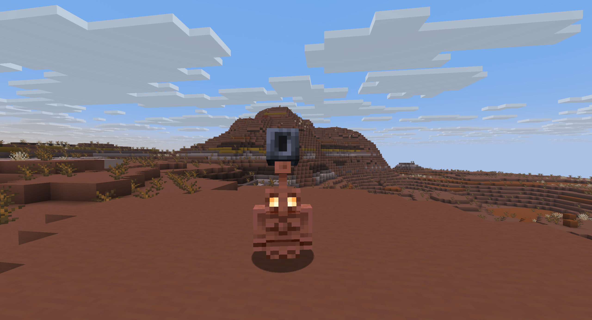

 

Make Copper Golems interact with Copper Buttons, like originally intended, and boost your builds with new decorative blocks!

-------------------------

### 🤖 Features

### COPPER FIRE AND CAMPFIRE

What happens if you mix Copper and Fire? You get Copper Fire!

This new Green Flame can be obtained if a Copper Block is set on fire.

Emits a light level of 13 and deals 1.5x fire damage

And, since there is Copper Fire, there's now also the Copper Campfire!

Crafted like a Soul Campfire, but using any Block that can produce Copper Fire in the middle.

Deals the same amount of damage as regular Campfire and drops a Copper Nugget if broken without Silk Touch.
Can be waterlogged

### COPPER HORN AND NEW GOAT HORN SOUNDS

Copper Horn was a scrapped feature from the Caves & Cliffs update, but now is back!

Crafted by surrounding a Goat Horn with 3 Copper Ingots, will return a different Copper Horn based on the Goat Horn used.

They'll produce a different sound based on how they are played:
- A high-pitched sound if the player is looking straight up
- A bass sound if the player is sneaking
- The regular sound otherwise

Also, two scrapped Goat Horn sounds has been added, that can also be turned into Copper Horns.

- Fly: dropped from regular Goats
- Resist: dropped from screaming Goats

### COPPER BUTTONS

Originally, Copper Golem was designed to interact with Copper Buttons.

Unfortunately, these have not been added with the Fall Drop.... until now!

Craft them using any Copper Block in a Stonecutter and use them in your builds.

They are also a unique redstone component, because they'll stay pressed the longer they're oxidized. 

When non-oxidized, they'll act like Stone buttons and stay pressed for 20 ticks, with each oxidation level increasing
the duration by 10 ticks.

If they are pressed while oxidizing, waxing or scraping, their press state will be reset.

Plus, if a Copper Golem stops on them, there's a chance that they'll press the button!

### MEDIUM WEIGHTED PRESSURE PLATES

Crafted with 2 copper ingots, these new Weighted Pressure Plates acts as a middle ground between the Light and the
Heavy Weighted ones.

They oxidize over time and can be waxed, like any other Copper Block, and behave exactly like a Weighted Pressure Plate
would do (except that you'll need fewer items to reach power level 15).

Like copper buttons, these will stay pressed longer based on their oxidation level (starting at 20 ticks, 
like regular pressure plates, going up to 50).

Also like copper buttons, if they are pressed while oxidizing, waxing or scraping, their power level will be reset.

### WRENCH

Using 2 Iron Ingots and 2 Copper Ingots you can craft a new tool: the Wrench!

With the wrench you can now rotate any Block that can be rotated without the need to break and place them again.

Left-click the Block with the Wrench to cycle the different orientations (if you are also sneaking, property will be cycled in the reversed order)

It has 512 uses

### IRON AND GOLD DECORATIVE BLOCKS

This new drop adds a ton of decorative blocks for Copper. So, why not give Iron and Gold the same treatment?

New Decorative Blocks for Iron and Gold has been added, putting them in parity with Copper!

Here's what's new:
- Cut Iron
  - Crafted with 4 Iron Blocks or with an Iron Block through the Stonecutter
  - Can be turned into Cut Iron Slabs and Stairs
- Chiseled Iron
  - Crafted with 2 Cut Iron Slabs or with an Iron Block through the Stonecutter
- Iron Grate
  - Crafted with 4 Iron Blocks, like a Copper Grate. Can be waterlogged
- Iron Button
  - Crafted with an Iron Block through the Stonecutter. Stay pressed for 15 ticks (in between wooden and stone buttons)
- Cut Gold
  - Crafted with 4 Gold Blocks or with a Gold Block through the Stonecutter
  - Can be turned into Cut Gold Slabs and Stairs
- Chiseled Gold
  - Crafted with 2 Cut Gold Slabs or with a Gold Block through the Stonecutter
- Golden Grate
  - Crafted with 4 Gold Blocks, like a Copper Grate. Can be waterlogged
- Gold Button
  - Crafted with a Gold Block through the Stonecutter. Stay pressed for 5 ticks (lower than wooden buttons)
- Golden Bars
  - Crafted with 6 Gold Ingots, like regular Bars. Can be waterlogged
- Golden Chain
  - Crafted with 2 Gold Nuggets and a Gold Ingot, like regular Chains. Can be waterlogged
- Golden Door
  - Crafted with 6 Gold Ingots, like regular Doors. Can be opened with a redstone signal.
- Golden Trapdoor
  - Crafted with 4 Gold Ingots, like Iron or Copper Trapdoors. Can be opened with a redstone signal and can be waterlogged
- Golden Lantern
  - Crafted with 8 Gold Nuggets and a Torch, like regular Lanterns. Emits a light level of 15. Can be waterlogged

### BETTER SHELVES

The Shelf is a great Block for building and decorations, and it has two modes of displaying Items. 
But only one is accessible in Vanilla Minecraft, which is a shame to be honest...

That's why, if you now Shift-Right Click a shelf with an empty hand, it will toggle its display mode!

### BETTER COPPER GOLEMS

Can't wait to have your Copper Golem statue? No problem! You can now craft them using a carved pumpkin and a Copper Block.

They'll also now deposit Items in Barrels and Shulker Boxes as well

The list of containers that the Copper Golem can deposit Items to is controlled by a new Block tag, 
`betterfalldrop:copper_golem_output_containers`. You can find the list of supported containers [here](https://github.com/JimiIT92/BetterFallDrop/blob/master/src/main/resources/data/betterfalldrop/tags/block/copper_golem_output_containers.json)

Iron Golems will sometimes place a Poppy on top of a Copper Golem.

But what if you don't want to wait for this event? Or, even better, you want to put
other type of items on it?

Well, now you can! You can now put a broader variety of Items and Blocks on top of a Copper Golem
by simply right-click.

The list is controlled by the `minecraft:shearable_from_copper_golem` tag, which has been expanded
to include all the Blocks and Items that you can now put on a Copper Golem.

This also means that, using a pair of Shears, you can take the Item back from the Copper Golem.

You can find the full list [here](https://github.com/JimiIT92/BetterFallDrop/blob/master/src/main/resources/data/minecraft/tags/item/shearable_from_copper_golem.json)

### COPPER ATTRACTS LIGHTNINGS

If there's a storm, you better not going out with some Copper Armor or let your Copper Golem outside, because
now a Lightning can strike any Player/Horse wearing some Copper Armor or any Copper Golem, if there are no
Lightning Rods nearby.

-------------------------

### 👨🏼‍💻 How to contribute

Anyone can contribute to Better Fall Drop, suggesting their ideas [using the Feature Request module](https://github.com/JimiIT92/BetterFallDrop/issues/new?assignees=JimiIT92&labels=enhancement&template=feature_request.md&title=)

If your idea makes it to the mod you'll also be mentioned in the mod's credits! 😁

-------------------------
### ⚙ Requirements

No additional mods are required.

-------------------------
### 🖥 Downloads

You can download Better Fall Drop on [CurseForge](https://www.curseforge.com/minecraft/mc-mods/hendrixs-better-summer-drop) or [Modrinth](https://modrinth.com/project/hendrixs-better-summer-drop/versions).

**I will post new releases only there**.

Any other websites that offers you Better Fall Drop shouldn't be trusted and should be reported immediately (as they could be a scam and contain malicious software)!

-------------------------
### 🍺 Support the project

Developing and maintaining Better Fall Drop, requires a lot of time and effort,
but after all I really enjoy doing this ❤

Better Fall Drop is, and **<ins>always</ins>** will be, **<ins>FREE TO USE</ins>**.

If someone asked you some money to download Better Fall Drop, I am afraid to tell you that you got scammed! 😥

But if you **really** want to financially support the project (or just buy me some beer to produce more code), these are the only ways:

&emsp;&emsp;&emsp;&emsp;&emsp;

Any other website asking you money for this project is a scam, and you should immediately report it to your local authorities as well! 😡

-------------------------
### 😁 Conclusion

[WIP] Mod Conclusion

I hope you enjoy Better Fall Drop as much as I enjoy develop new ideas and content for it,
and let me know if there are any issues on the [issue tracker](https://github.com/JimiIT92/BetterFallDrop/issues/new?assignees=JimiIT92&labels=enhancement&template=bug_report.md&title=).

Have a nice day! 😁